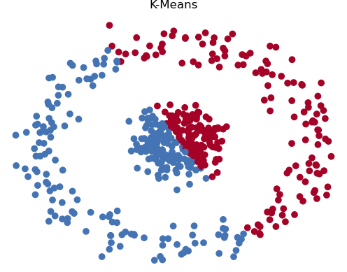
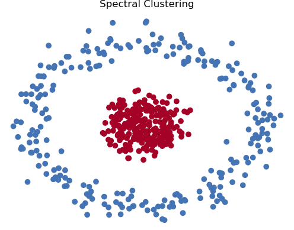

# K-Means Clustering Algorithm

[](https://opensource.org/licenses/MIT)

This repository contains a Python implementation of the K-Means clustering algorithm. The K-Means algorithm is an unsupervised machine learning technique used to group data points together in a dataset based on their features. It identifies patterns in a dataset by computing the similarities between data points and partitioning the dataset into clusters, where the data points within each cluster are more similar to each other than to those in other clusters.

## Clustering

Clustering is an important technique in machine learning and data analysis. It allows us to discover inherent structures and patterns in data without any prior knowledge or labels. Clustering is particularly useful in various applications such as customer segmentation, image segmentation, and anomaly detection.

## K-Means Algorithm

The K-Means algorithm is one of the most widely used clustering algorithms. It aims to partition a given dataset into K clusters. The algorithm iteratively assigns each data point to the closest cluster based on a distance metric and recalculates the centroids of the clusters by taking the mean of the data points within each cluster. This process continues until the centroids no longer change significantly or a maximum number of iterations is reached.

### Advantages of K-Means

- Simplicity: K-Means is relatively simple to understand and implement, making it accessible to users with varying levels of experience.
- Efficiency: The algorithm can handle large datasets efficiently, making it suitable for real-world applications.
- Interpretability: The results of K-Means are easily interpretable, as the clusters represent distinct groups of data points.
- Numeric Data: K-Means is well-suited for clustering datasets with numeric values.

### Disadvantages of K-Means

- Initialization Sensitivity: K-Means is sensitive to the initial positions of the centroids, which can lead to different results.
- Linear Separability Assumption: K-Means assumes that the data is linearly separable, which limits its applicability to datasets with complex structures.
- Single Data Type: K-Means computes similarity based on distances, making it unsuitable for datasets with different data types.

### Algorithm Overview

The K-Means algorithm can be summarized in the following steps:

1. Randomly initialize K centroids.
2. For each data point, compute the distance to each centroid and assign the data point to the closest cluster.
3. Recompute the centroids by taking the mean of all the data points within each cluster.
4. Repeat steps 2 and 3 until the centroids no longer change significantly or the maximum number of iterations is reached.

### K-Means++ Initialization

K-Means++ is an improved initialization method for K-Means. It addresses the sensitivity to centroid initialization by selecting initial centroids that are well-distributed across the dataset. The K-Means++ algorithm selects the first centroid randomly and subsequent centroids by maximizing the minimum distance to all existing centroids. This initialization method leads to faster convergence and reduces the risk of getting stuck in local optima.

## Usage

The main function in the `kmeans.py` file is `kmeans`, which performs the K-Means clustering algorithm on a given dataset. Here's how you can use it:

```python
import numpy as np
from kmeans import kmeans

# Create a numpy array of data points
X = np.array([[1, 2], [3, 4], [5, 6], [7, 8]])

# Set the number of clusters (K)
k = 2

# Perform K-Means clustering
centroids, labels = kmeans(X, k)

# Print the resulting centroids and labels
print("Centroids:")
print(centroids)
print("Labels:")
print(labels)
```

The `kmeans` function takes the following parameters:

- `X` (numpy.ndarray): The input data points.
- `k` (int): The number of clusters.
- `centroids` (numpy.ndarray, optional): The initial centroids. If not provided, random data points will be chosen as centroids. You can also use "kmeans++" to initialize centroids using the K-Means++ algorithm.
- `max_iter` (int, optional): The maximum number of iterations. Default is 30.
- `tolerance` (float, optional): The convergence tolerance. Default is 1e-2.

The function returns the final centroids and labels assigned to each data point.

Output:
```
Centroids:
[[3. 4.]
 [7. 8.]]
Labels:
[0, 0, 0, 1]
```

## Examples

### Image Compression (Greyscale)

The K-Means algorithm can be used for image compression. Here's an example of compressing a greyscale image using K-Means clustering:

```python
import numpy as np
import matplotlib.pyplot as plt
from skimage import io
from kmeans import kmeans

# Load the image
img = 'dog.jpeg'
X = io.imread(img)

# Store the image height and width
height = X.shape[0]
width = X.shape[1]

# Flatten the image into a 1D array
X = X.squeeze().reshape(-1, 1)

# Set the number of clusters (K)
k = 4

# Perform K-Means clustering
centroids, labels = kmeans(X, k=k, centroids='kmeans++', tolerance=0.01)

# Assign each data point to its closest centroid
X = centroids[labels]

# Display the compressed image
io.imshow(X.reshape(height, width, 1).astype("uint8"))
```
<p align="left">
  
  
</p>

### Image Compression (Color)

The K-Means algorithm can also be used for color compression. Here's an example of compressing a color image using K-Means clustering:

```python
import numpy as np
import matplotlib.pyplot as plt
from skimage import io
from kmeans import kmeans

# Load the image
img = 'dogs.jpeg'
X = io.imread(img)

# Store the image height and width
height = X.shape[0]
width = X.shape[1]

# Flatten the image into a 1D array
X = X.squeeze().reshape(-1, 1)

# Set the number of clusters (K)
k = 6

# Perform K-Means clustering
centroids, labels = kmeans(X, k=k, centroids='kmeans++', tolerance=0.01)

# Assign each data point to its closest centroid
X = centroids[labels]

# Display the compressed image
io.imshow(X.reshape(height, width, 3).astype("uint8"))
```
<p align="left">
  
  
</p>

## Spectral Clustering

Spectral clustering is another popular clustering algorithm in machine learning which is commonly used in the fields of community detection and recommendation systems. It uses eigenvalues and eigenvectors of a similarity matrix to partition the given dataset.

The basic idea of spectral clustering is to transform the data to a different space where the clusters are easily separable, and then apply a clustering algorithm to the transformed data.

### Advantages of Spectral Clustering
Compared to K-Means, spectral clustering has the following advantages:

- Spectral clustering can handle non-linearly separable data and data with complex structures.
- Since spectral clustering considers the overall structure of the data, it is more robust to noise and outliers.
- Spectral clustering can automatically determine the number of clusters
- Spectral clustering can handle datasets with different data types

For example, the data set I use below is not linearly separable, it shows that spectral clustering performs much better than K-Means in this case.

```python
import numpy as np
import matplotlib.pyplot as plt
from sklearn.datasets import make_circles
from sklearn.cluster import SpectralClustering
from kmeans import kmeans

# Generate a dataset with two interlaced circles
X, _ = make_circles(n_samples=500, noise=0.1, factor=0.2)

# Perform K-Means clustering
k = 2
centroids_kmeans, labels_kmeans = kmeans(X, k=k, centroids='kmeans++')

# Perform Spectral clustering
spectral_cluster = SpectralClustering(n_clusters=k, affinity="nearest_neighbors")
labels_spectral = spectral_cluster.fit_predict(X)

# Plot the results of K-Means clustering
colors_kmeans = np.array(['#4574B4','#A40227'])
plt.scatter(X[:, 0], X[:, 1], c=colors_kmeans[labels_kmeans])
plt.title("K-Means")
plt.show()

# Plot the results of Spectral clustering
colors_spectral = np.array(['#4574B4','#A40227'])
plt.scatter(X[:, 0], X[:, 1], c=colors_spectral[labels_spectral])
plt.title("Spectral Clustering")
plt.show()
```
<p align="left">
  
  
</p>

### Disadvantages of Spectral Clustering
However, spectral clustering also has its weaknesses:

- Spectral clustering can be computationally expensive, especially when dealing with large datasets
- Since spectral clustering is a graph-based clustering algorithm, it requires knowledge of the graph structure of the data

## Conclusion

In this repository, you will find a Python implementation of the K-Means clustering algorithm, along with examples showcasing its applications in image compression and a comparison with spectral clustering. Clustering algorithms like K-Means and spectral clustering are powerful tools for data analysis and understanding complex datasets. Feel free to explore and adapt the code for your own projects!

If you have any questions or suggestions, please feel free to reach out.

## License

This project is licensed under the [MIT License](LICENSE).

## Acknowledgments

The project structure is adapted from the MSDS 689 course materials provided by the University of San Francisco (USFCA-MSDS). Special thanks to the course instructors for the inspiration.
